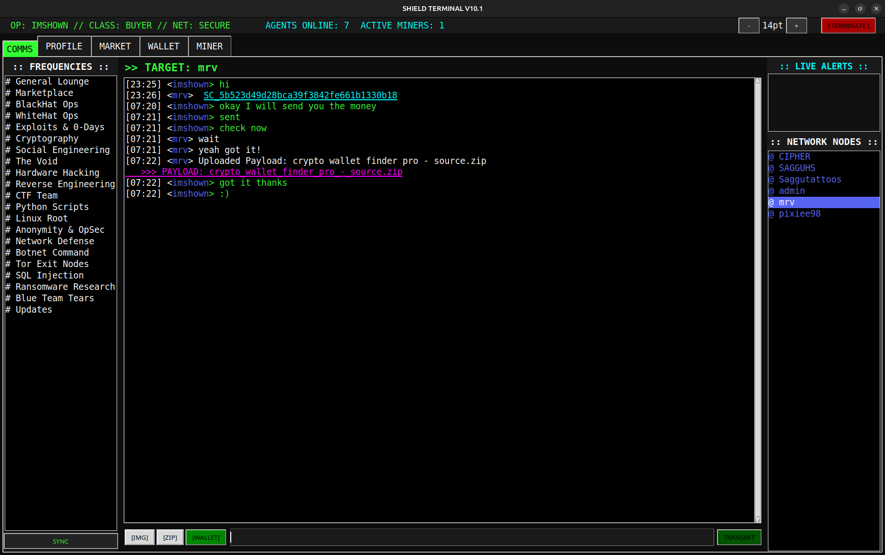

# HNet // Shield Terminal Node 🛡️

[](https://github.com/hsecurities/hnet/tree/main/client)
[]()
[](https://shield.hsecurities.in)

**HNet (Shield Terminal)** is a sovereign, decentralized workstation designed for encrypted communication, blockchain mining, and financial freedom. This repository hosts the official binary distributions for Windows and Linux.



---

## ⚡ System Capabilities

*   **🕵️ Encrypted Comms:** Private, peer-to-peer messaging and global frequency channels. No central logs.
*   **💸 Shield Wallet:** Built-in ECDSA wallet generation. Send/Receive Shield Coin (SC) instantly.
*   **⛏️ Background Miner:** Contribute to network security and earn SC rewards using CPU mining.
*   **📦 Payload Exchange:** Drag-and-drop file sharing (Images/ZIPs) directly through the terminal.
*   **🌑 Cyberpunk Interface:** Low-latency, keyboard-centric GUI optimized for operators.

---

## 📥 Download & Installation

### 🪟 Windows (v10.3)
1.  Navigate to the **[Client Folder](/client)** above.
2.  Download **`ShieldTerminal.exe`**.
3.  Run the installer.
    *   *Note: If Windows Defender flags the file, this is a False Positive due to the compiled Python environment. Click "More Info" -> "Run Anyway".*

### 🐧 Linux (v10.3)
1.  Navigate to the **[Client Folder](/client)** above.
2.  Download **`shield_linux.deb`**.
3.  Install via terminal:
    ```bash
    sudo apt install ./shield_linux.deb
    ```

---

## 🌐 Live Network Status
View the public ledger, block height, and active nodes at our explorer:
👉 **[https://shield.hsecurities.in](https://shield.hsecurities.in)**

---

## ⚠️ Disclaimer
*This software is provided "as is". The HNet ecosystem is a simulation of a decentralized network for educational and ethical testing purposes.*

---
**[HNET_SYSTEMS]** // *End of Transmission*
