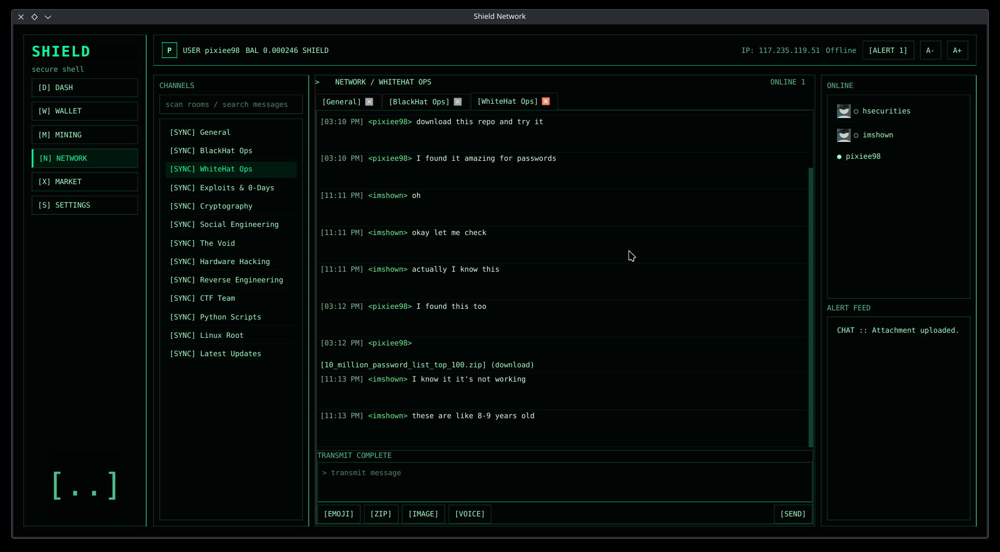

# HNet // Shield Terminal Node 🛡️

[](https://github.com/hsecurities/hnet/tree/main/client)
[]()
[](https://shield.hsecurities.in)

**HNet (Shield Terminal)** is a sovereign, decentralised workstation designed for encrypted communication, blockchain mining, and financial freedom. This repository hosts the official binary distributions for Windows and Linux.



---

## ⚡ System Capabilities

*   **🕵️ Encrypted Comms:** Private, peer-to-peer messaging and global frequency channels. No central logs.
*   **💸 Shield Wallet:** Built-in ECDSA wallet generation. Send/Receive Shield Coin (SC) instantly.
*   **⛏️ Background Miner:** Contribute to network security and earn SC rewards using CPU mining.
*   **📦 Payload Exchange:** Drag-and-drop file sharing (Images/ZIPs) directly through the terminal.
*   **🌑 Cyberpunk Interface:** Low-latency, keyboard-centric GUI optimized for operators.
*   **🌑 Link click issue fixed:** The link issue has been fixed.
*   **🌑 The price view added:** The price view graph has been added.

---

## 📥 Download & Installation

### 🐧 Linux (v11.2.0)
1.  Navigate to the **[Updates Folder](https://github.com/hsecurities/hnet/releases/tag/Linux)** above.
2.  Download **`shield-network-11-2-9.deb`**.
3.  Install via terminal:
    ```bash
    sudo apt install ./shield-network-11-2-9.deb
    ```

### Windows (v11.2.0)
1.  Navigate to the **[Updates Folder](https://github.com/hsecurities/hnet/releases/tag/Windows)** above.
2.  Download **```shield-desktop-11-2-0-setup.exe```**.
3.  Download and Install

---

## 🌐 Live Network Status
View the public ledger, block height, and active nodes at our explorer:
👉 **[https://hnet.hsecurities.in](https://hnet.hsecurities.in)**

---

## ⚠️ Disclaimer
*This software is provided "as is". The HNet ecosystem is a standalone of a decentralised network for educational and ethical purposes.*

---
**[HNET_SYSTEMS]** // *End of Transmission*
 
